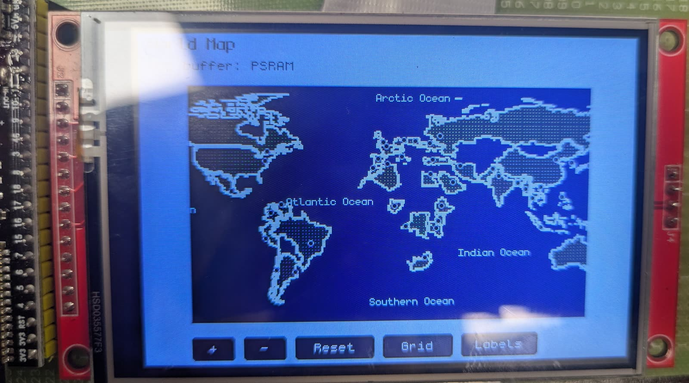
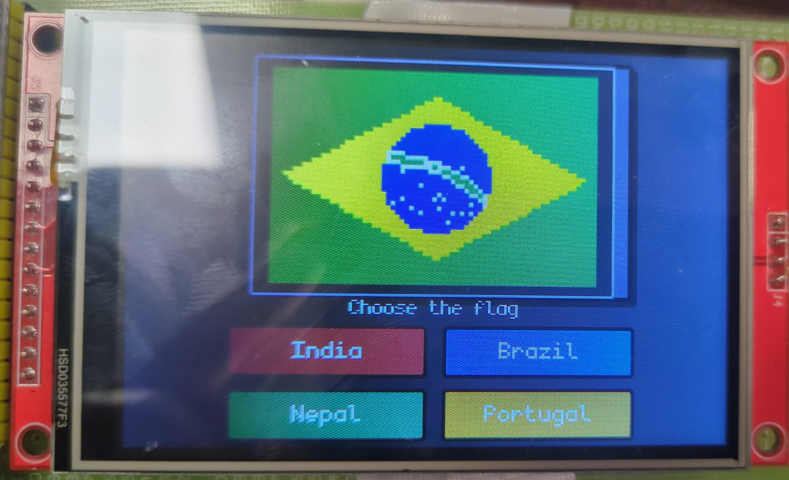
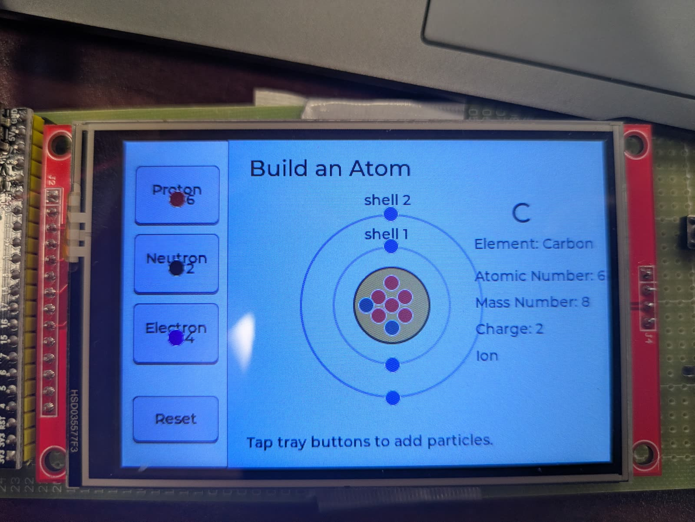
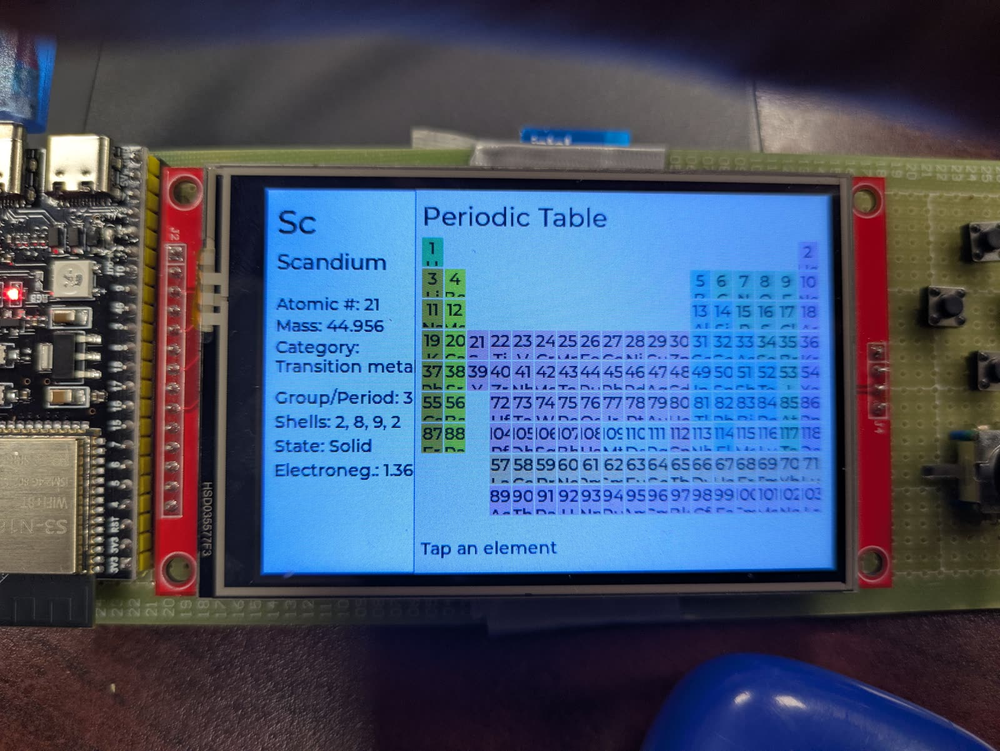
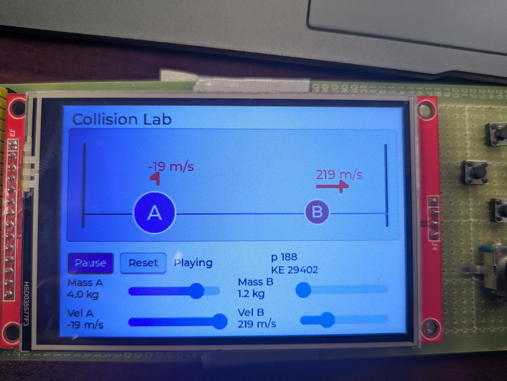
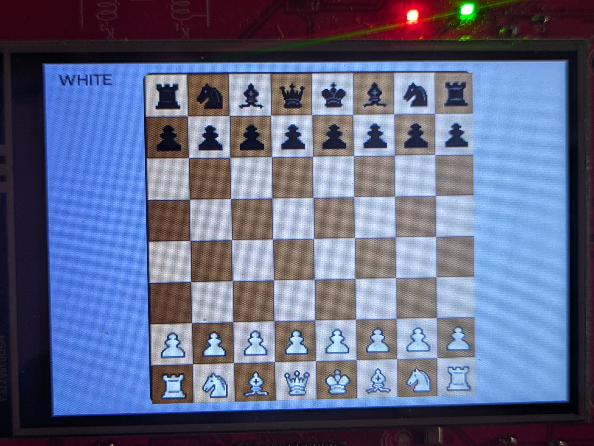
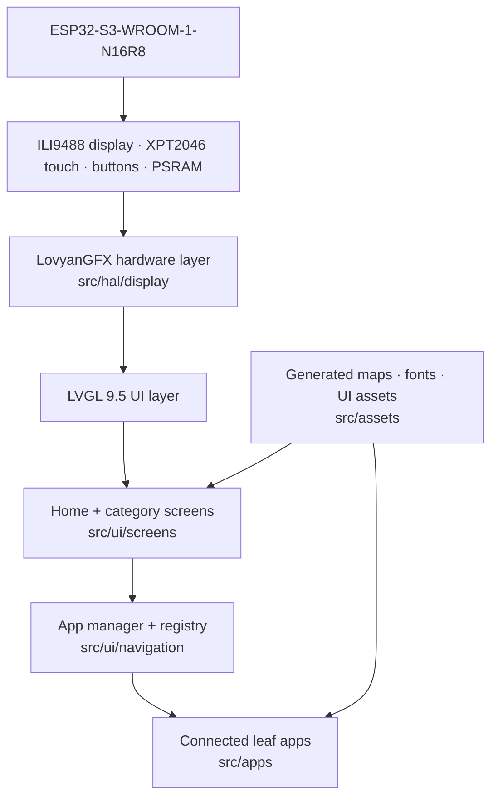
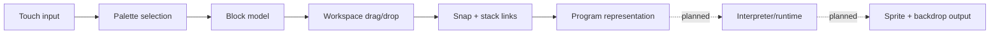
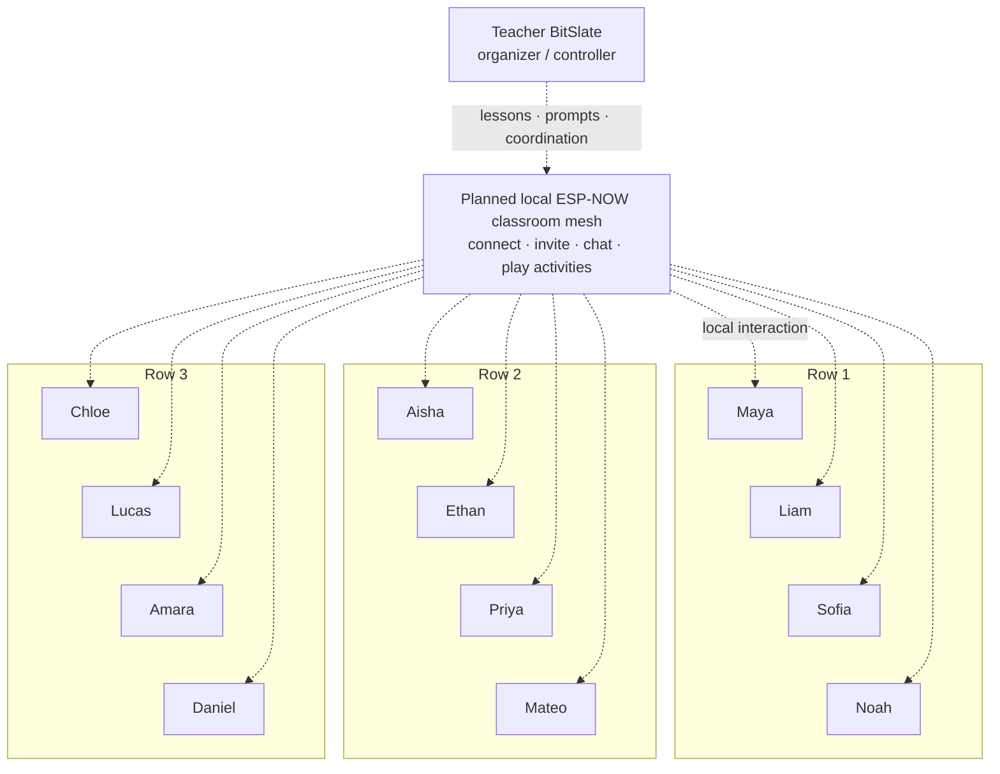

# BitSlate

### A tiny offline classroom computer for every child.


BitSlate is a low-cost offline-first portable educational computer built around the ESP32-S3. It brings geography, interactive science, calculators, coding tools and games into one compact touch device. It is similar in spirit to OLPC but designed around inexpensive embedded hardware.

BitSlate is still firmly in the prototype stage. The core proof of concept is working: a touchscreen educational device with a modular launcher and a growing suite of applications running locally on the ESP32-S3. Classroom networking, persistence and production hardware remain future work.

## What is BitSlate?

BitSlate is intended to be an integrated educational computing environment, not merely an ESP32 development board, a classroom clicker, or a low-cost tablet. Applications are designed for the constraints and affordances of a small embedded device: immediate startup, touch-first interaction, local computation, and no required cloud service.

## Vision

The long-term goal is a classroom set of inexpensive devices that can operate independently or communicate locally. A learner should be able to explore a map, run a physics experiment, practice coding, create, or play a learning game without an account or internet connection. Teacher-led lessons, quizzes, challenges, and responses over ESP-NOW are planned, not yet implemented.

## Current prototype

- ESP32-S3-WROOM-1-N16R8 target with 16 MB flash and 8 MB octal PSRAM.
- 480×320 ILI9488 display and XPT2046-compatible resistive touch through LovyanGFX.
- LVGL 9.5 launcher, category menus, app registry, lifecycle management, and back navigation.
- Eleven connected leaf applications spanning geography, physics, chemistry, mathematics, and games.
- Touch input plus three active-low physical navigation buttons; the graphing calculator also supports a rotary encoder.
- A desktop BitBlocks interaction prototype that specifies the future device-native coding editor.

## Key features

| Feature | Maturity | Description |
| --- | --- | --- |
| Offline-first applications | Working prototype | The launcher and connected apps run locally without cloud services or internet access. |
| Touch-first UI | Working | 480×320 LVGL interface driven by resistive touch/stylus input. |
| Modular app system | Working | A central registry and app manager handle launch, cleanup, transitions, and back navigation. |
| Interactive science | Working prototypes | Embedded circuit, collision, masses-and-springs, atom, and periodic-table experiences. |
| Geography exploration | Working prototypes | Zoomable world map, vector-based U.S. states quiz, and world flags quiz. |
| BitBlocks | Desktop prototype | Touch-oriented block editor specification with drag/drop, snapping, sprites, and backdrops; device runtime is not implemented. |
| Physical controls | Working | Left, right, and back inputs; app-local rotary encoder support in the graphing calculator. |
| Classroom networking | Planned | ESP-NOW teacher/student activities are architectural future work; no networking code is present yet. |

## Demo and gallery

### Interactive world map



The map prototype renders generated Natural Earth data locally with touch-based pan and zoom, labels, capitals, and optional grid detail. These interactions form the foundation for map exploration and geography activities.

### Learning applications on hardware

| Flags quiz | Build an Atom |
| --- | --- |
|  |  |
| Four-choice touch quiz using locally stored flag assets. | Particle controls update element identity, mass, and charge. |

| Periodic table | Collision Lab |
| --- | --- |
|  |  |
| Tap an element to inspect its properties. | Adjust masses and velocities and observe a 1D elastic collision. |

### Chess



The current touch chess prototype supports local turn-taking and legal piece movement. Computer play and invitations to nearby BitSlate players are planned extensions.

## Applications

These are the leaf apps currently registered in `src/ui/navigation/app_registry.cpp`.

| App | Status | Description |
| --- | --- | --- |
| Chess | Working prototype | A touch chess activity with legal piece movement, captures, turns, and automatic queen promotion. Inviting another BitSlate player locally and playing against the computer are planned; networking and AI are not implemented. |
| World Map | Working prototype | Locally rendered world map with touch pan/zoom, labels, capitals, and grid controls. |
| Masses / Springs | Working prototype | Hooke's-law simulation with gravity, damping, controls, and live displacement/force readouts. |
| Collision | Working prototype | Two-body 1D elastic collision with adjustable mass and velocity plus momentum and energy readouts. |
| Circuits | Working prototype | Battery, bulb, and wire placement with closed-loop detection and bulb state. |
| Periodic Table | Working prototype | Interactive 118-element grid and property panel. |
| Atom Lab | Working prototype | Proton, neutron, and electron controls with derived element, mass, and charge. |
| Graphing Calculator | Working prototype | Function plotting, value table, trace controls, and a compact expression parser. |
| Scientific Calculator | Working prototype | Arithmetic and common scientific functions with degree/radian modes and error handling. |
| US States Quiz | Working prototype | Vector-derived map quiz with touch hit detection and persistent correct-state highlighting. |
| World Flags Quiz | Working prototype | Four-answer flag identification flow with feedback and timed progression. |

### Present in the launcher but inactive

| Item | Status | Reason |
| --- | --- | --- |
| Waves | Placeholder | Card exists; no matching application implementation. |
| Kinematics | Placeholder | Card exists; no matching application implementation. |
| Forces | Placeholder | Card exists; no matching application implementation. |
| Settings | Placeholder | Home card exists; no settings application implementation. |

### Planned / future work

| Area | Intended direction |
| --- | --- |
| BitBlocks on device | Port the frozen desktop interaction model to LVGL, then add a bounded interpreter/runtime. |
| Classroom networking | ESP-NOW teacher/student roles, lesson prompts, quizzes, coding challenges, and responses. |
| Creative tools | Drawing/art and music environments. |
| More science experiences | Additional embedded simulations after current prototypes are hardened. |
| Persistence | Local saves, learner progress, and settings. |

## System architecture



`src/main.cpp` initializes the display, LVGL buffers, touch callback, button polling, and Home screen. Navigation is deferred through `app_manager` so apps can clean up timers and buffers safely during transitions.

## BitBlocks

BitBlocks is currently a frozen PySide6 desktop prototype and a port specification, not a connected firmware app. It demonstrates palette browsing, clone-on-drop blocks, workspace dragging, basic vertical snapping, linked stacks, zoom/pan, and sprite/backdrop selection. Play and Stop are visual controls only; there is no interpreter or generated-code runtime yet.



Run the desktop prototype:

```powershell
cd desktop-prototypes\bitslate_blocks
python -m pip install -r requirements.txt
python main.py
```

See [`BITBLOCKS_PORT_SPEC.md`](BITBLOCKS_PORT_SPEC.md) for the device port contract.

## Classroom networking

BitSlate is designed not only as a personal learning device but also as a locally interconnected classroom computer. The planned ESP-NOW layer will let students discover nearby BitSlates, connect, invite classmates into activities, exchange messages, and participate in shared learning experiences without internet access. This extends the peer-oriented classroom idea behind OLPC through inexpensive BitSlate hardware.



The repository does not currently contain ESP-NOW transport, peer discovery, chat, invitations, multiplayer, or teacher/student workflow code. The diagram represents the intended 12-student classroom architecture.

## Hardware

| Component | Specification / role |
| --- | --- |
| MCU module | ESP32-S3-WROOM-1-N16R8 target |
| Flash | 16 MB module; PlatformIO uses `huge_app.csv` |
| PSRAM | 8 MB octal PSRAM (`qio_opi`) |
| Display | ILI9488 TFT, 480×320 landscape, SPI |
| Touch | XPT2046-compatible resistive touch, shared SPI bus |
| Input | Touch/stylus; active-low Back, Left, and Right buttons; app-local encoder for graph trace |
| Networking | ESP32-S3 Wi-Fi/BLE capability; no networking feature is initialized in the current firmware |
| Storage | Firmware and static assets in flash; no application persistence/filesystem is configured |
| Power | Prototype board power is not documented; the display backlight is tied directly to 5 V |

Full electrical notes are in [`docs/HARDWARE.md`](docs/HARDWARE.md).

## Pinout

| Function | GPIO | Bus / notes |
| --- | ---: | --- |
| TFT SCLK | 17 | SPI2 clock; shared with touch |
| TFT MOSI | 18 | SPI2 controller-to-peripheral; shared with touch |
| TFT MISO | 6 | SPI2 peripheral-to-controller; shared with touch |
| TFT CS | 9 | ILI9488 chip select |
| TFT DC | 8 | Display data/command |
| TFT RST | 3 | Display reset; strapping-sensitive prototype connection |
| Touch CS | 7 | XPT2046 chip select |
| Touch IRQ | N/A | Not connected (`-1`) |
| Back / encoder press | 20 | Active-low, `INPUT_PULLUP` |
| Left | 47 | Active-low, `INPUT_PULLUP` |
| Right | 48 | Active-low, `INPUT_PULLUP` |
| Graph encoder A | 38 | Used only by Graphing Calculator |
| Graph encoder B | 39 | Used only by Graphing Calculator |
| Backlight | N/A | Not GPIO-controlled; tied to 5 V |

> **Prototype hardware note:** GPIO3 is an ESP32-S3 strapping pin and is currently used for TFT reset. Avoid forcing an unintended level during reset. GPIO37 is reserved by the module's octal PSRAM interface and must not be used.

## Software stack

| Layer | Technology |
| --- | --- |
| MCU | ESP32-S3 |
| Firmware | C++17 / Arduino |
| Build system | PlatformIO |
| UI | LVGL 9.5 |
| Display/touch HAL | LovyanGFX 1.2.x |
| Display controller | ILI9488 over SPI2 |
| Touch controller | XPT2046-compatible over shared SPI2 |
| Media | Generated RGB565/ARGB8888 descriptors, generated vector/grid map data |
| Local networking | Planned ESP-NOW; not implemented |
| Persistent storage | Not configured in current firmware |

## Project status

| Area | Status |
| --- | --- |
| ESP32-S3 hardware prototype | ✅ Working |
| 480×320 touch UI | ✅ Working |
| Launcher, categories, and app registry | ✅ Working |
| Eleven registered educational apps | ✅ Working prototypes |
| Geography pan/zoom and quizzes | ✅ Working prototypes |
| BitBlocks desktop interaction model | ✅ Working prototype |
| BitBlocks device port and execution engine | 🚧 Not implemented |
| Classroom ESP-NOW workflows | 🧭 Planned |
| Save/progress system | 🧭 Planned |
| Art and music environments | 🧭 Planned |
| Custom PCB / production hardware | 🧭 Future work |

The current clean firmware build uses 209,884 / 327,680 bytes of static RAM (64.1%) and 2,950,353 / 3,145,728 bytes of flash (93.8%). Flash headroom is limited, so new bitmap assets require care.

## Repository structure

```text
bitslate-firmware/
├── include/                 # Board configuration and LVGL configuration
├── src/
│   ├── apps/                # Embedded games, geography, math, and science apps
│   ├── assets/              # Generated UI, font, sprite, and map assets
│   ├── hal/                 # LovyanGFX display/touch hardware layer
│   ├── ui/navigation/       # App registry, lifecycle, and navigation manager
│   └── ui/screens/          # Home and subject launcher screens
├── desktop-prototypes/      # Python/PySide6 interaction prototypes
├── portable-core/           # Hardware-independent models and tests
├── docs/                    # Architecture, roadmap, hardware, and media
├── research/                # Design notes and upstream research
├── platformio.ini           # ESP32-S3 PlatformIO environment
└── project_context.md       # Detailed current implementation context
```

## Building and flashing

### Requirements

- [PlatformIO Core](https://docs.platformio.org/en/latest/core/installation/index.html) or the PlatformIO IDE extension
- A compatible ESP32-S3-WROOM-1-N16R8 prototype
- USB connection and the correct serial port for your machine

```bash
git clone https://github.com/aranis22/bitslate-firmware.git
cd bitslate-firmware
pio run
pio run -t upload                    # optionally add --upload-port <PORT>
pio device monitor
```

`platformio.ini` currently contains `COM15` as the developer's monitor default. Override it locally if your board appears on another port.

## Roadmap

1. Port the BitBlocks editor model to a memory-bounded LVGL implementation.
2. Add ESP-NOW transport and explicit teacher/student device roles.
3. Build classroom lesson, quiz, challenge, and response workflows.
4. Add local persistence for programs, progress, and settings.
5. Expand creative and science applications.
6. Reduce flash pressure through asset packing and performance work.
7. Move from prototype wiring toward custom production hardware.

## Contributing and license

Issues and focused pull requests are welcome. Keep hardware, UI, navigation, and application layers separate; register leaf apps through the app registry; provide cleanup for owned timers/buffers; and run `pio run` before submitting firmware changes. See [`AGENTS.md`](AGENTS.md) and [`project_context.md`](project_context.md) for project-specific constraints.

No software or hardware license file is currently included. Public visibility alone does not grant permission to copy, modify, or redistribute the code. A formal open-source license must be chosen by the repository owner before the project can be described as licensed open source.
