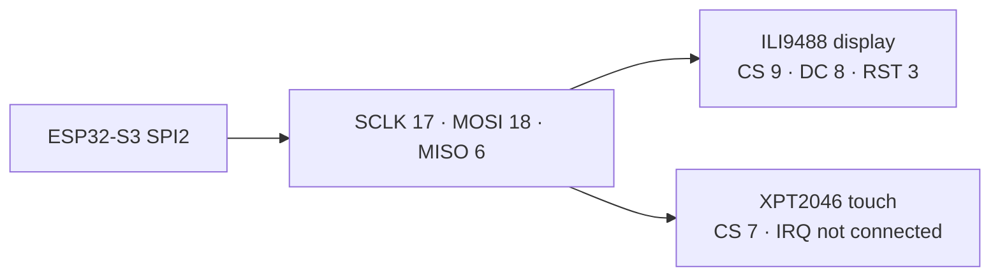

# BitSlate prototype hardware

This document describes the current firmware target. Values come from `include/bitslate_config.h`, `src/hal/display/LGFX_BitSlate.hpp`, `src/ui/screens/button_input.cpp`, `src/apps/stem/math/graphing_calculator/GraphingCalculatorApp.cpp`, and `platformio.ini`.

## Core hardware

| Component | Current prototype configuration |
| --- | --- |
| MCU module | ESP32-S3-WROOM-1-N16R8 |
| Flash | 16 MB module; `huge_app.csv` application partition |
| PSRAM | 8 MB octal PSRAM; QIO flash / OPI PSRAM configuration |
| Display | ILI9488, native 320×480 panel rotated to 480×320 landscape |
| Display bus | SPI2, mode 0, 40 MHz write / 16 MHz read configuration |
| Touch | XPT2046-compatible resistive controller on shared SPI2 at 2.5 MHz |
| Touch calibration | Raw X/Y ranges 200–3900; firmware retains an X-axis inversion wrapper |
| Primary input | Resistive touch/stylus and three active-low buttons with internal pull-ups |
| Optional app input | Quadrature encoder on GPIO38/GPIO39 in Graphing Calculator |
| Backlight | Tied directly to 5 V; no firmware-controlled backlight GPIO |

The repository does not document the complete prototype power circuit, battery, regulator, connector, or production PCB. Those details are intentionally not inferred here.

## Pinout

| Function | GPIO | Direction / bus | Notes |
| --- | ---: | --- | --- |
| TFT SCLK | 17 | SPI2 output | Shared clock for display and touch |
| TFT MOSI | 18 | SPI2 output | Shared controller-to-peripheral data |
| TFT MISO | 6 | SPI2 input | Shared peripheral-to-controller data |
| TFT CS | 9 | Output | ILI9488 chip select, active low |
| TFT DC | 8 | Output | Display data/command select |
| TFT RST | 3 | Output | Display reset; see strapping note below |
| Touch CS | 7 | Output | XPT2046 chip select, active low |
| Touch IRQ | — | Not connected | Configured as `-1`; touch is polled |
| Back / encoder press | 20 | Input pull-up | Active low; exits to the previous menu |
| Left | 47 | Input pull-up | Active low; Home carousel navigation |
| Right | 48 | Input pull-up | Active low; Home carousel navigation |
| Graph encoder A | 38 | Input pull-up | Graphing Calculator trace control only |
| Graph encoder B | 39 | Input pull-up | Graphing Calculator trace control only |
| Backlight | — | Fixed power | LED tied directly to 5 V |

## Shared SPI topology

LovyanGFX uses bus locking because display and touch share SPI2. The display declares the bus as shared. Do not replace `LGFX_BitSlate::getTouch(...)` X-inversion without recalibrating and validating touch on hardware.

## Prototype constraints

- **GPIO3 is strapping-sensitive.** It drives TFT reset. The display circuitry must not force an unintended level while the ESP32-S3 samples strapping pins at reset.
- **GPIO37 is unavailable.** The N16R8 module uses it for the octal PSRAM interface; do not assign it to controls or peripherals.
- **Backlight is always powered.** `PIN_TFT_BL` is `-1`; firmware cannot dim or switch the current backlight wiring.
- **GPIO38/GPIO39 are app-local.** The Graphing Calculator initializes them rather than the central board configuration. Any future reassignment should first centralize these pins in `include/bitslate_config.h`.
- **Touch is single-pointer resistive input.** Do not assume multitouch gestures.

## Configuration sources

- Board-wide display, touch, and navigation pins: `include/bitslate_config.h`
- ILI9488/XPT2046 bus configuration: `src/hal/display/LGFX_BitSlate.hpp`
- Button debounce and active-low behavior: `src/ui/screens/button_input.cpp`
- Graphing encoder pins: `src/apps/stem/math/graphing_calculator/GraphingCalculatorApp.cpp`
- Flash/PSRAM/build environment: `platformio.ini`
